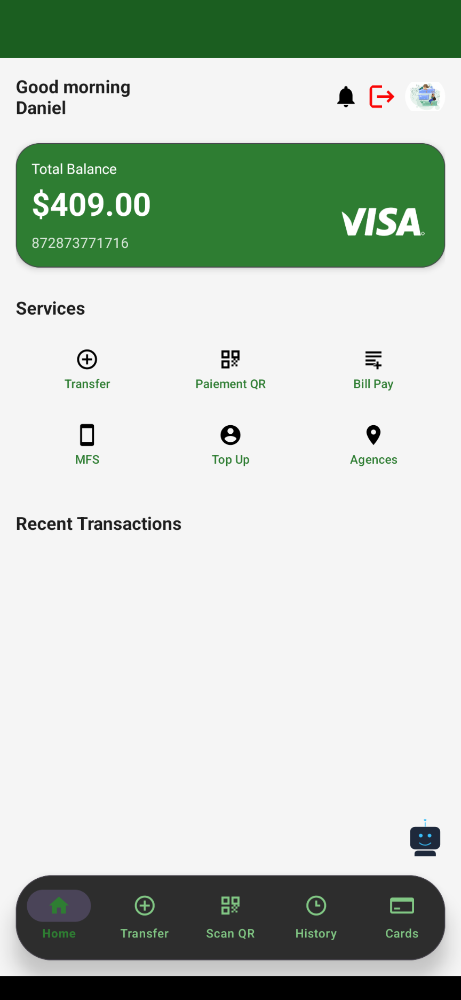
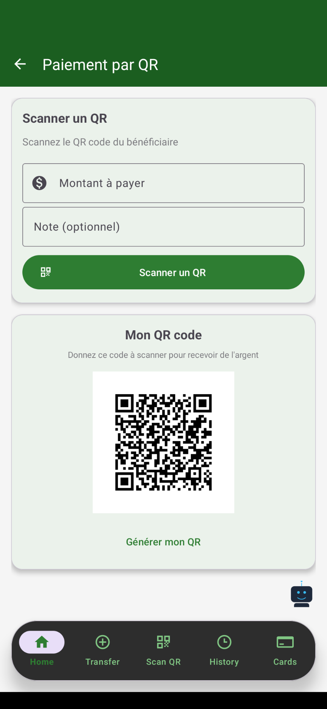
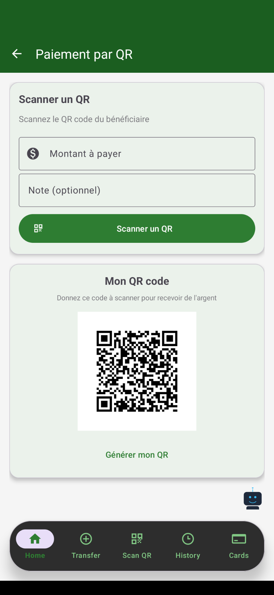
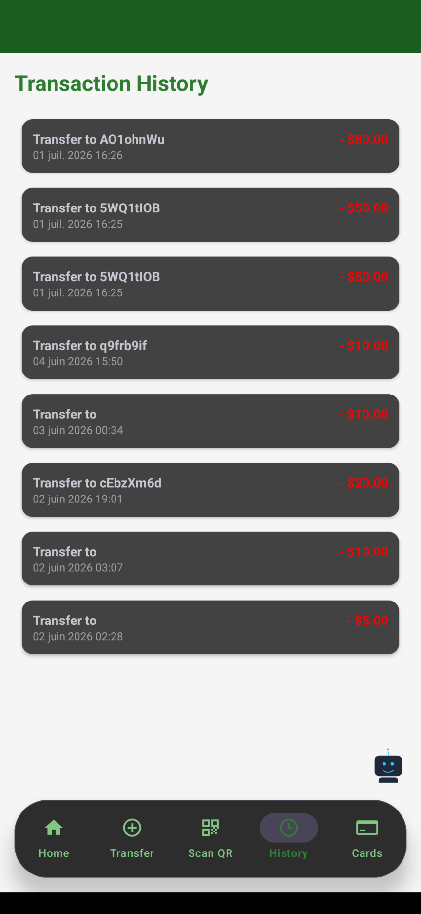

Mobile Banking App

Une application Android moderne de banque mobile développée avec Kotlin, Firebase et l'API GROQ.
## 📸 Aperçu

<p align="center">



</p>

---

# ✨ Fonctionnalités

- Authentification Firebase
- Gestion des utilisateurs
- Tableau de bord bancaire
- Paiement QR Code
- Génération QR Code
- Historique des transactions
- Dépôt
- Retrait
- Transfert d'argent
- Gestion des cartes
- Notifications
- Assistant IA
- Material Design 3

---

# 🛠 Technologies

| Technologie | Utilisation |
|-------------|-------------|
| Kotlin | Développement Android |
| Firebase Authentication | Authentification |
| Cloud Firestore | Base de données |
| Firebase Storage | Stockage |
| Firebase Cloud Messaging | Notifications |
| Material Design 3 | Interface utilisateur |
| ZXing | Lecture QR Code |
| QR Generator | Génération QR |
| API GROQ | Assistant IA |
| MVVM | Architecture |

---

# 📂 Architecture

```
app
│
├── activities
├── adapters
├── fragments
├── models
├── repositories
├── viewmodels
├── firebase
├── utils
└── services
```

---

# 🚀 Installation

```bash
git clone https://github.com/VOTRE-NOM/Mobile-Banking-App.git
```

Ouvrir avec Android Studio.

Ajouter votre fichier

```
google-services.json
```

Puis synchroniser Gradle.

---

# 🔥 Firebase

- Authentication
- Firestore
- Storage
- FCM

---

# 🤖 Intelligence Artificielle

Cette application intègre un assistant IA basé sur **API GROQ** permettant une assistance intelligente directement dans l'application.

---

# 📸 Captures d'écran

| Home | Paiement QR | Historique |
|------|-------------|------------|
|  |  |  |

---

# 📈 Roadmap

- [x] Authentification
- [x] QR Code
- [x] Paiement
- [x] Assistant IA
- [x] Firebase
- [ ] Paiement NFC

---

# ⭐ Soutenez le projet

Si ce projet vous plaît :

⭐ Star le dépôt GitHub

🍴 Fork le projet

🐛 Signalez les bugs

💡 Proposez des améliorations

---

# 📄 Licence

Distribué sous licence **MIT**.

Voir le fichier **LICENSE** pour plus d'informations.

---

# 👨‍💻 Développeur

**Votre Nom**

Android Developer • Kotlin • Firebase • IA • Full Stack Developer

GitHub :  https://github.com/kojo-codeur/bank_mobile_et_assistant_groq


---

© 2026 Tous droits réservés.
